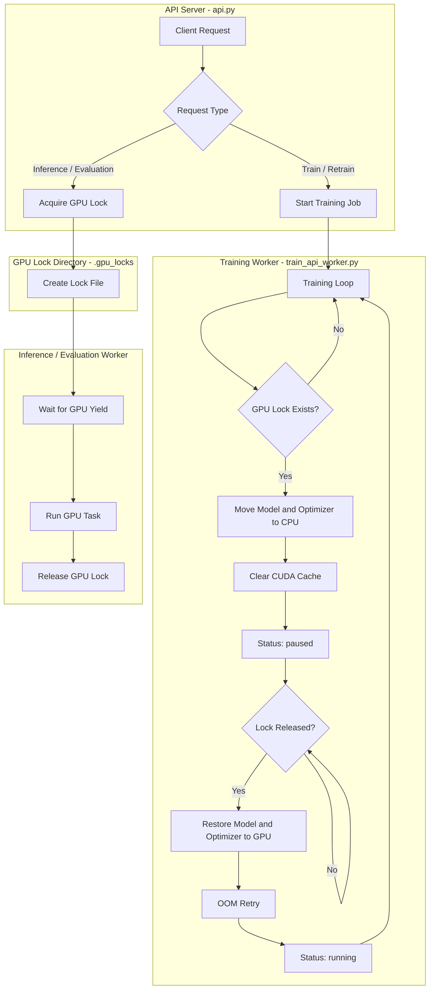
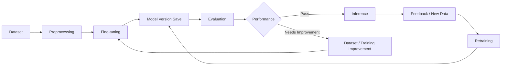

# 🛡️ SOFTY-AI
### Risk Detection Model & GPU Resource-Aware AI Backend

SOFTY는 교사와 학부모 간의 소통 과정에서 발생할 수 있는 분쟁 가능성을 사전에 탐지하고,
보다 안전한 의사소통을 지원하기 위한 서비스입니다.

SOFTY-AI는 SOFTY의 AI 기능을 담당하는 Backend Repository로,
`kakaocorp/kanana-safeguard-8b`를 기반으로 입력 문장을 SAFE / UNSAFE로 분류합니다.

모델 Fine-tuning부터 Evaluation, Retraining, 실시간 Inference까지 하나의 API 환경에서
관리할 수 있도록 구성했으며, 제한된 Single GPU 환경에서 Background Training과
실시간 추론·평가가 동시에 수행될 때 발생할 수 있는 GPU 자원 경합 문제를 줄이기 위한
GPU Lock & Yield 구조를 구현했습니다.

---

## 👨‍💻 My Role

프로젝트에서 AI 개발을 담당했습니다.

주요 담당 범위:

- Kanana Safeguard 8B 기반 SAFE / UNSAFE 분류 모델 Fine-tuning
- AI Hub 및 Smilegate UnSmile 데이터를 활용한 학습 데이터 구성
- Precision / Recall / F1-score 기반 모델 Evaluation
- 평가 결과 분석을 통한 Dataset 확장 및 모델 성능 개선
- FastAPI 기반 AI Backend 개발
- Training / Retraining / Evaluation / Inference 기능 구성
- Model Version별 학습 및 평가 결과 관리
- 제한된 GPU 환경에서 학습과 실시간 요청이 공존할 수 있도록 GPU 자원 관리 구조 구현

---

## 📌 Project Overview

```text
Teacher Message
      ↓
   SOFTY-AI
      ↓
Risk Detection Model
      ↓
 SAFE / UNSAFE
```

AI Backend에서는 Risk Detection뿐 아니라
모델의 전체 학습 및 운영 흐름을 관리합니다.

```text
Dataset
   ↓
Fine-tuning
   ↓
Evaluation
   ↓
Model Version
   ↓
Inference
   ↓
Feedback / New Data
   ↓
Retraining
```

---

## 📊 Final Model Performance

모델 개선 이후 평가 결과는 다음과 같습니다.

| Metric | Score | UI Display |
|---|---:|---:|
| Precision | 0.8681 | 86.81% |
| Recall | 0.8160 | 81.60% |
| F1-score | 0.8412 | 84.12% |
| Pass Threshold | 0.8000 | 80.00% |
| Result | PASS | PASS |

최종 평가에서 F1-score 0.8412를 기록하여
프로젝트에서 설정한 통과 기준인 0.8000을 충족했습니다.

서비스 UI에서는 사용자가 결과를 직관적으로 확인할 수 있도록
0~1 범위의 평가값을 백분율 형태로 변환하여 표시했습니다.

---

# 📈 Dataset Expansion & Performance Improvement

## 1. Initial Training

초기에는 AI Hub에서 확보한 유해표현 관련 데이터를 기반으로
Kanana Safeguard 8B를 Fine-tuning했습니다.

초기 모델의 평가 결과는 다음과 같았습니다.

| Metric | Initial |
|---|---:|
| Precision | 0.8846 |
| Recall | 0.7360 |
| F1-score | 0.8035 |

Precision은 상대적으로 높았지만 Recall이 0.7360으로 낮게 나타났습니다.

즉, 모델이 UNSAFE라고 판단한 결과의 정확도는 비교적 높았지만,
실제 위험 문장 중 일부를 SAFE로 판단하여 놓치는 경향이 있음을 확인했습니다.

SOFTY는 메시지에서 분쟁 가능성이 있는 표현을 사전에 탐지하는 것을 목적으로 하기 때문에,
위험 표현의 미탐지를 줄이는 것이 중요하다고 판단했습니다.

---

## 2. Dataset Expansion

초기 평가 결과를 바탕으로 모델이 보다 다양한 형태의 위험 표현을
학습할 필요가 있다고 판단했습니다.

이에 기존 AI Hub 데이터에
Smilegate가 GitHub에 공개한 UnSmile Dataset을 추가하여
학습 데이터의 범위를 확장했습니다.

```text
Initial Dataset
      ↓
    AI Hub
      ↓
Performance Evaluation
      ↓
Low Recall Identified
      ↓
Dataset Expansion
      ↓
AI Hub + Smilegate UnSmile
      ↓
Retraining
      ↓
Re-Evaluation
```

단순히 Epoch 수나 학습 횟수를 증가시키는 것보다,
모델이 접하는 위험 표현의 종류와 범위를 넓히는 방향으로
성능 개선을 진행했습니다.

학습 데이터는 프로젝트에서 사용하는 SAFE / UNSAFE 형태로 가공하여 관리했습니다.

```text
0 = UNSAFE
1 = SAFE
```

---

## 3. Performance Improvement

Dataset 확장 후 모델을 다시 학습하고 동일한 방식으로 평가했습니다.

| Metric | Before | After | Change |
|---|---:|---:|---:|
| Precision | 0.8846 | 0.8681 | -0.0165 |
| Recall | 0.7360 | 0.8160 | +0.0800 |
| F1-score | 0.8035 | 0.8412 | +0.0377 |

Precision은 소폭 감소했지만,
Recall이 0.7360에서 0.8160으로 상승했습니다.

이를 통해 실제 위험 표현을 놓치는 경향을 줄이고
Precision과 Recall 사이의 균형을 개선할 수 있었습니다.

또한 F1-score 역시 0.8035에서 0.8412로 향상되었습니다.

```text
Improved Evaluation

Precision : 0.8681
Recall    : 0.8160
F1-score  : 0.8412
Result    : PASS
```

서비스 UI에서는 다음과 같이 표시했습니다.

```text
Precision : 86.81%
Recall    : 81.60%
F1-score  : 84.12%
```

이 과정을 통해 모델 성능은 모델 구조나 Hyperparameter뿐 아니라
학습 데이터의 구성과 다양성에도 크게 영향을 받을 수 있다는 점을 확인했습니다.

또한 하나의 지표만 높이는 것보다
서비스 목적에 맞게 Precision과 Recall을 함께 분석하고
두 지표의 균형을 고려하는 것이 중요하다는 점을 경험했습니다.

---

# 🔬 Model Evaluation

## Evaluation Protocol

모델 평가에서는 SAFE와 UNSAFE 데이터를 균형 있게 구성하여 사용했습니다.

```text
SAFE       250 samples
UNSAFE     250 samples
----------------------
Total      500 samples
```

UNSAFE 탐지를 Positive Class로 설정하고 다음 지표를 사용했습니다.

```text
Precision = TP / (TP + FP)

Recall = TP / (TP + FN)

F1-score = 2 × Precision × Recall
           ──────────────────────
             Precision + Recall
```

프로젝트에서 사용한 기본 모델 통과 기준은 다음과 같습니다.

```text
F1-score >= 0.8000
```

평가 결과와 진행 상태를 Database에 저장하여
Model Version별 성능을 확인할 수 있도록 구성했습니다.

---

## Additional ROC-AUC Evaluation

Precision / Recall / F1-score뿐 아니라
분류 임계값 변화에 따른 모델의 전반적인 분류 성능을 확인하기 위해
별도의 ROC-AUC 평가도 수행했습니다.

아래는 특정 Model Version을 대상으로 진행한 평가 예시입니다.

```text
Example Model Version : vX.X
Total Samples         : 500
UNSAFE                : 250
SAFE                  : 250
ROC-AUC               : 0.8920
```

해당 Model Version은 평가 과정을 설명하기 위한 예시이며,
최종 배포 모델의 Version을 의미하지 않습니다.

ROC-AUC 평가에서는 SAFE / UNSAFE에 대한 모델 출력값을 기반으로
분류 임계값 변화에 따른 성능을 확인했습니다.

ROC 평가 과정에서도 다른 GPU 작업과의 자원 충돌을 줄이기 위해
GPU Lock 구조를 활용했습니다.

---

# ✨ Key Features

## 1. Risk Detection

- 입력 문장을 SAFE / UNSAFE로 분류
- Kanana Safeguard 8B 기반 Fine-tuning
- Fine-tuned Model Version별 저장 및 관리
- FastAPI 기반 실시간 Risk Detection API 제공
- 특정 Model Version을 지정하여 Inference 가능

---

## 2. Fine-tuning Pipeline

제한된 GPU 환경에서 모델을 학습하기 위해
전체 Model Parameter가 아닌 일부 Layer를 선택적으로 학습하도록 구성했습니다.

주요 설정:

- Base Model: `kakaocorp/kanana-safeguard-8b`
- 일부 Transformer Layer 선택적 Fine-tuning
- `lm_head`, `norm` 학습
- bfloat16 사용
- Gradient Checkpointing 적용
- Actual Batch Size 1
- Gradient Accumulation 적용
- Validation Loss 기반 Model 저장
- Train / Retrain 작업 분리

---

## 3. Automatic Model Evaluation

Fine-tuned Model을 자동으로 평가할 수 있도록
별도의 Evaluation Worker를 구성했습니다.

평가 결과로 다음 정보를 관리합니다.

- Precision
- Recall
- F1-score
- Pass / Fail
- Evaluation Progress
- Model Version
- Dataset Version

평가 결과는 Database에 저장하여
Model Version별 성능을 비교할 수 있도록 구성했습니다.

---

## 4. Retraining

새롭게 수집된 데이터 또는 사용자 피드백을
기존 Fine-tuned Model에 반영할 수 있도록 Retraining Pipeline을 구성했습니다.

```text
Inference
    ↓
Feedback / New Data
    ↓
Retraining
    ↓
Evaluation
    ↓
New Model Version
```

이를 통해 모델을 한 번 학습한 뒤 고정하는 것이 아니라,
추가 데이터가 발생했을 때 재학습하고 성능을 다시 검증할 수 있도록 구성했습니다.

---

# 🚨 Problem: Single GPU Resource Conflict

프로젝트에서는 하나의 GPU에서 다음과 같은 작업을 처리해야 했습니다.

```text
Background Fine-tuning
        +
Real-time Inference
        +
Model Evaluation
```

Fine-tuning이 GPU Memory를 점유하고 있는 상황에서
Inference 또는 Evaluation Worker가 추가로 Model을 GPU에 올릴 경우,
VRAM 부족으로 인해 OOM이 발생할 수 있었습니다.

반대로 실시간 요청이 발생할 때마다 학습 프로세스를 종료하면
GPU 자원은 확보할 수 있지만 진행 중이던 학습 흐름을 유지하기 어렵다는 문제가 있었습니다.

---

# 💡 Solution: GPU Lock & Yield

학습 프로세스를 유지하면서 실시간 요청을 우선 처리할 수 있도록
`.gpu_locks` 기반 GPU Coordinator를 구현했습니다.

```text
Training
   ↓
Real-time Request
   ↓
Create GPU Lock
   ↓
Training detects Lock
   ↓
Model / Optimizer → CPU
   ↓
Clear CUDA Cache
   ↓
Training PAUSED
   ↓
Inference / Evaluation
   ↓
Release Lock
   ↓
Model / Optimizer → GPU
   ↓
Training RUNNING
   ↓
Resume
```

동작 과정:

1. Inference 또는 Evaluation 요청이 GPU Lock 생성
2. Training Worker가 학습 과정에서 Lock 확인
3. Model을 CPU Memory로 이동
4. Optimizer State를 CPU Memory로 이동
5. CUDA Cache 정리
6. Training 상태를 `paused`로 변경
7. Inference 또는 Evaluation 수행
8. 작업 종료 후 GPU Lock 해제
9. Model과 Optimizer State를 GPU로 복구
10. Training 상태를 `running`으로 변경
11. 기존 학습 재개

GPU 복구 과정에서 OOM이 발생하는 경우에는
CUDA Cache를 정리한 후 재시도하도록 구성했습니다.

---

## Inference Process Isolation

PyTorch Model을 Python Process 내부에서 제거하더라도
CUDA Context나 Cache 등의 영향으로 GPU Memory가 즉시 모두 반환되지 않을 수 있습니다.

이를 줄이기 위해 실시간 Inference는
별도의 Worker Process에서 실행하도록 구성했습니다.

```text
API Server
    ↓
Inference Worker Process
    ↓
Load Model
    ↓
Inference
    ↓
Process Exit
```

Inference가 완료된 후 Worker Process가 종료되도록 하여
프로세스가 사용하던 GPU Resource를 정리할 수 있도록 구성했습니다.

---

# 🏗️ System Architecture



---

# 🔄 Training & Evaluation Flow



---

# 🧠 Model Training Strategy

## Selective Fine-tuning

VRAM 사용량을 줄이기 위해 전체 Model을 학습하지 않고
일부 Parameter만 학습 대상으로 설정했습니다.

예시 학습 대상:

```text
lm_head
norm
Transformer Layer 30
Transformer Layer 31
```

나머지 Parameter는 Freeze하여
제한된 GPU 환경에서 Fine-tuning할 수 있도록 구성했습니다.

---

## Gradient Checkpointing

Intermediate Activation 저장에 필요한 GPU Memory를 줄이기 위해
Gradient Checkpointing을 적용했습니다.

일부 연산을 Backward 과정에서 다시 수행하는 대신,
Training 과정에서 사용하는 GPU Memory를 줄일 수 있도록 했습니다.

---

## Gradient Accumulation

DataLoader의 Actual Batch Size는 OOM 방지를 위해 1로 유지하고,
설정한 Batch Size만큼 Gradient를 누적한 후 Optimizer Step을 수행합니다.

예시:

```text
Requested Batch Size = 8

Batch 1
Batch 1
Batch 1
Batch 1
Batch 1
Batch 1
Batch 1
Batch 1
   ↓
Gradient Accumulation
   ↓
Optimizer Step
```

---

# 🧰 Tech Stack

| Category | Technology |
|---|---|
| Language | Python |
| Deep Learning | PyTorch |
| NLP / LLM | Hugging Face Transformers |
| Base Model | Kanana Safeguard 8B |
| API | FastAPI, Uvicorn |
| Data Processing | Pandas |
| Training | Accelerate, Gradient Checkpointing |
| Database | SQLite |
| GPU | CUDA |
| Evaluation | Precision, Recall, F1-score, ROC-AUC |

---

# 📁 Directory Structure

```text
SOFTY-AI/
│
├── src/
│   ├── api.py
│   │   └── FastAPI Main Server
│   │
│   ├── database.py
│   │   └── SQLite Connection / Job State Management
│   │
│   ├── train_api_worker.py
│   │   └── Fine-tuning / Retraining / GPU Yield
│   │
│   ├── eval_api_worker.py
│   │   └── Model Evaluation
│   │
│   └── inference_worker.py
│       └── SAFE / UNSAFE Inference
│
├── data/
│   └── Training / Evaluation Dataset
│
├── model/
│   └── Fine-tuned Model Versions
│
├── .gpu_locks/
│   └── GPU Resource Coordination
│
├── requirements.txt
└── README.md
```

---

# 🗃️ Database

SQLite 기반 Database를 사용하여
학습 및 평가 작업 상태와 관련 정보를 관리합니다.

## training_jobs

Training 및 Retraining 작업 상태를 저장합니다.

```text
job_id
job_type
status
epoch
batch_size
learning_rate
progress
version
```

Status:

```text
queued
running
paused
completed
failed
```

---

## evaluations

Model Evaluation 결과를 저장합니다.

```text
evaluation_id
version
dataset_version
status
progress
precision
recall
f1_score
passed
```

---

## api_tokens

외부 API 사용과 관련된 Token 정보를 기록합니다.

```text
endpoint
input_tokens
output_tokens
total_tokens
created_at
```

---

# 📦 Dataset

Fine-tuning 및 Evaluation 데이터는
SAFE / UNSAFE 이진 분류 형태로 관리합니다.

예시:

```csv
content,label
"일반적인 안전 문장입니다.",1
"위험하거나 분쟁 가능성이 있는 문장입니다.",0
```

Label:

```text
0 = UNSAFE
1 = SAFE
```

Dataset 개선 과정:

```text
Initial
AI Hub Dataset

      ↓

Evaluation

      ↓

Smilegate UnSmile Dataset 추가

      ↓

AI Hub + UnSmile

      ↓

Retraining

      ↓

Improved Model
```

---

# 🔌 API Endpoints

| Endpoint | Method | Description |
|---|---|---|
| `/health` | GET | API Server 상태 확인 |
| `/ai/training-jobs/risk-detection` | POST | Risk Detection Model 학습 요청 |
| `/ai/training-jobs/status` | GET | 현재 학습 상태 및 진행률 조회 |
| `/ai/training-jobs/history` | GET | Training History 조회 |
| `/ai/training-jobs/retrain` | POST | Feedback / 추가 데이터 기반 Retraining |
| `/ai/evaluate/risk-detection` | POST | 특정 Model Version 평가 |
| `/ai/evaluate/result` | GET | Precision / Recall / F1-score 조회 |
| `/ai/inference/risk-detection` | POST | SAFE / UNSAFE 실시간 추론 |

---

# ⚙️ Installation

## 1. Clone Repository

```bash
git clone https://github.com/26-1-project-softy/SOFTY-AI.git
cd SOFTY-AI
```

## 2. Install Dependencies

```bash
pip install -r requirements.txt
```

주요 Dependency:

```text
torch
transformers
pandas
accelerate
fastapi
uvicorn
```

---

# ▶️ Usage

아래 Model Version은 실행 방법을 보여주기 위한 예시값입니다.

## API Server

```bash
python src/api.py
```

Default Port:

```text
65001
```

---

## Training Worker

```bash
python src/train_api_worker.py \
  --job_id "train_example" \
  --dataset_version "vX.X" \
  --epoch 4 \
  --batch_size 8 \
  --learning_rate 0.00005
```

---

## Evaluation Worker

```bash
python src/eval_api_worker.py \
  --evaluation_id "eval_example" \
  --version "vX.X" \
  --dataset_version "vX.X"
```

---

## Inference Worker

```bash
python src/inference_worker.py \
  "분류할 문장" \
  "vX.X"
```

---

# 💡 What I Learned

이 프로젝트에서는 사전학습 모델을 단순히 Fine-tuning하는 것에서 끝나지 않고,
실제 서비스에서 AI Model을 운영하기 위한 전체 과정을 경험했습니다.

```text
Problem Definition
      ↓
Dataset Construction
      ↓
Fine-tuning
      ↓
Evaluation
      ↓
Error Analysis
      ↓
Dataset Expansion
      ↓
Retraining
      ↓
Performance Improvement
      ↓
Model Serving
```

초기 Evaluation에서 Precision에 비해 상대적으로 낮은 Recall을 확인했고,
위험 표현의 다양성을 더 확보할 필요가 있다고 판단했습니다.

이에 AI Hub 데이터에 Smilegate UnSmile Dataset을 추가하여
학습 데이터를 확장하고 모델을 다시 학습했습니다.

그 결과 Recall을 0.7360에서 0.8160으로,
F1-score를 0.8035에서 0.8412로 개선할 수 있었습니다.

이 과정에서 단순히 학습을 반복하는 것보다
평가 결과를 분석하고 원인을 가정한 뒤,
데이터 구성과 학습 방법을 수정하고 다시 검증하는 과정의 중요성을 경험했습니다.

또한 모델 성능 자체뿐 아니라
Single GPU라는 제한된 환경에서 Training과 Real-time Inference를
어떻게 함께 운영할 것인지에 대한 문제도 직접 다뤘습니다.

GPU Lock & Yield, 별도 Worker Process,
Model Version 관리, Evaluation 및 Retraining Pipeline을 구현하면서
Model Training뿐 아니라 AI Backend와 Model Serving까지
AI Engineering의 전체 흐름을 경험할 수 있었습니다.

---

# ⚠️ Current Limitations & Future Work

현재 시스템은 프로젝트 환경에 맞춰
Single GPU를 중심으로 설계되어 있습니다.

또한 SAFE / UNSAFE 이진 분류를 기준으로 하기 때문에
위험 표현의 세부 유형을 별도로 분류하지는 않습니다.

향후 개선 방향:

- Evaluation Dataset 확대
- 별도 Hold-out Test Set 구축
- 실제 서비스 Class Imbalance를 고려한 평가
- 위험 유형 Multi-class 분류
- GPU Scheduler 고도화
- Multi-GPU 환경 지원
- Model Registry 도입
- Automated Deployment Pipeline 구축
- Model Monitoring 강화
- 사용자 Feedback 기반 지속적인 Dataset 개선

---

# 📎 Conclusion

SOFTY-AI는 교사와 학부모 간의 메시지에서
분쟁 가능성이 있는 표현을 탐지하기 위해
Kanana Safeguard 8B를 Fine-tuning하고,

이를 실제 서비스에서 사용할 수 있도록
Training, Evaluation, Retraining, Inference 기능을
하나의 AI Backend로 구성한 프로젝트입니다.

초기 모델의 평가 결과를 분석하여
AI Hub 데이터에 Smilegate UnSmile 데이터를 추가했고,
Recall과 F1-score를 실제로 개선했습니다.

또한 제한된 Single GPU 환경에서
Background Training과 Real-time Request가 충돌하는 문제를
GPU Lock & Yield 구조를 통해 조율했습니다.

이를 통해 Dataset 구성과 Model Fine-tuning뿐 아니라
성능평가, Error Analysis, Retraining,
GPU Resource Management, Model Serving까지
AI Engineering의 전체 흐름을 경험할 수 있었습니다.
